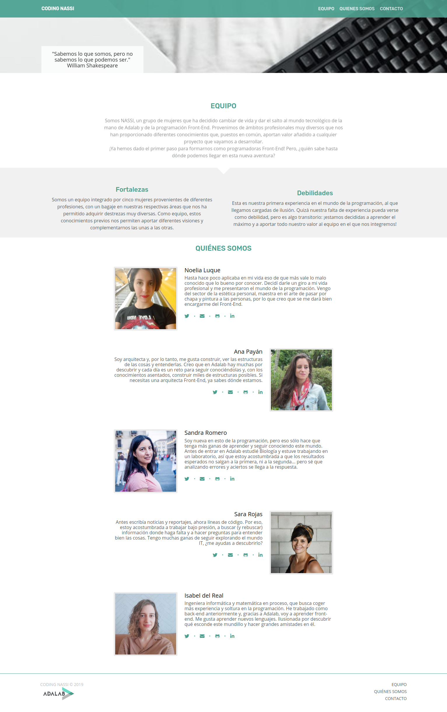

# ¿Qué es Coding Nassi?

Bienvenidos a Coding Nassi, la primera página web de [N]oelia, [A]na, [S]andra, [S]ara e [I]sabel, un grupo de mujeres que han decidido dar el salto a la programación de la mano de Adalab.

## ¿Cómo puedes acompañarnos en esta aventura?

Nos encantaría que tú, que ya conoces a fondo este sector, nos tendieras la mano y nos ayudaras a mejorar nuestro código con sugerencias, aportaciones y propuestas de mejora. Pero de buen rollo, que se aprende más y mejor ;)

## Y, puestos a pedir, ¿por qué no nos das una ⭐ y sigues nuestros perfiles de GitHub para ver cómo evolucionamos en el sector?

> ### https://github.com/nlsabariego
>
> ### https://github.com/anapayanruiz
>
> ### https://github.com/sandra9ro
>
> ### https://github.com/srojasz
>
> ### https://github.com/ibelreal

## Nosotras también podemos ayudarte: ¿qué crees que podemos aportar a tu proyecto?

> ### Ponte en contacto con nosotras y cuéntanoslo

- codingnassi@gmail.com

> ### Estaremos encantadas de poner el talento y las ganas de Nassi a tu disposición

## Gracias por dedicarnos un ratito de tu tiempo ⏰
